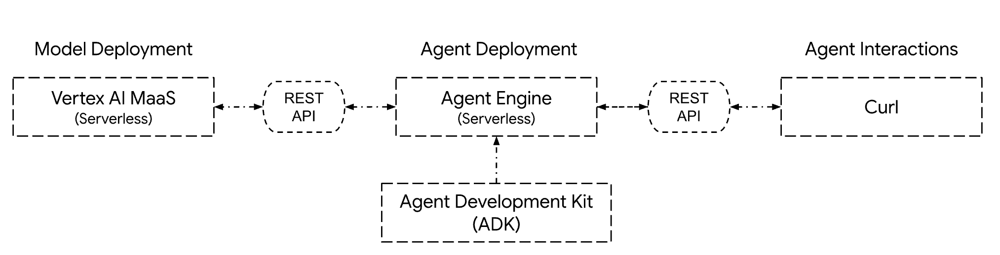
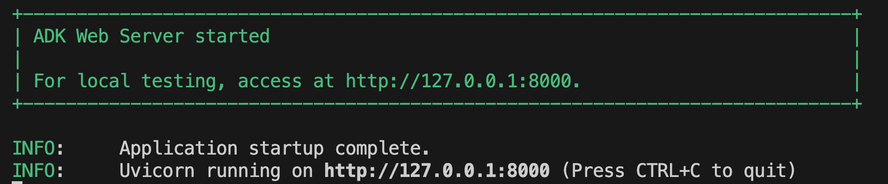
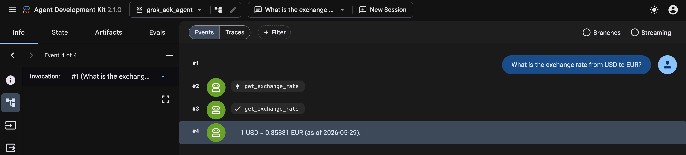
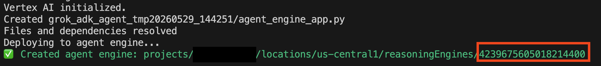

#  **Building Grok Powered Agents with Google Cloud Agent Development Kit (ADK)**
**Tech Stack:** `Python`, `Google Cloud ADK`, `Vertex AI MaaS`, `Agent Engine`

# **1\. Introduction**

## **Objective**
In this tutorial, you will learn how to build a production-ready AI agent using the **Google Cloud Agent Development Kit (ADK)**. We will leverage **Grok ** via Vertex AI’s **Model-as-a-Service (MaaS)** for serverless reasoning and deploy the final agent to the fully managed **Vertex AI Agent Engine** for enterprise-grade scalability.

## **Goals**
* Enable **Grok 4.20(Reasoning)** on Vertex AI MaaS.  
* Initialize an agent using the **ADK** Python library.  
* Implement custom **tools** for the agent to interact with external data (e.g. get latest currency exchange rates).  
* **Test** the agent locally using the ADK development server.  
* **Deploy** the agent to **Agent Engine** and query it via API.

### **Scope**

* Single-agent orchestration using ADK.  
* Serverless inference using Grok (no infrastructure management).  
* Deployment to Agent Engine (serverless) runtime.

### **Out of Scope**

* Building a custom frontend UI.  
* Complex tools calling (will be discussed in future tutorials)  
* Complex multi-model orchestration or multi-Agent delegation (A2A protocol).  

## **2\. Prerequisites & Setup**

Before you begin, ensure you have the following:

### **Google Cloud Resources**

* A [**Google Cloud Project**](https://console.cloud.google.com/projectselector2/home/dashboard) with [billing](https://docs.cloud.google.com/billing/docs/how-to/verify-billing-enabled#confirm_billing_is_enabled_on_a_project) enabled.  
* Enabled APIs:
  * [**Vertex AI API**](https://console.cloud.google.com/flows/enableapi?apiid=aiplatform.googleapis.com)   
  * [**Compute Engine API**](https://console.cloud.google.com/flows/enableapi?apiid=compute.googleapis.com)  
  * [**Resource Manager API**](https://console.cloud.google.com/flows/enableapi?apiid=cloudresourcemanager.googleapis.com)  
* Model Access: [**Grok 4.20(Reasoning) API Service**](https://console.cloud.google.com/vertex-ai/publishers/xai/model-garden/grok-4.20-reasoning)(MaaS) enabled.

### **Local Development Environment**

* **uv** [installed](https://docs.astral.sh/uv/getting-started/installation/) and Python 3.10+ [installed using uv](https://docs.astral.sh/uv/guides/install-python/)  
* **gcloud CLI** [installed](https://docs.cloud.google.com/sdk/docs/install-sdk) and [authenticated](https://docs.cloud.google.com/sdk/docs/install-sdk#initializing-the-cli).

```shell

# Create a uv project and navigate in to it
uv init grok-adk-agent
cd grok-adk-agent

# Create and activate python virtual environment
uv venv
source ./.venv/bin/activate

# Install the dependencies (Google ADK, LiteLLM and Requests libraries)
uv add "google-adk[extensions]" requests google-cloud-aiplatform
```

## **3\. Architecture Overview**

The architecture follows a "Brain-Tools-Runtime" pattern.

1. **The Brain:** Grok 4.20(Reasoning) provides high-reasoning capabilities. VertexAI Model as a Service (MaaS) provides the serverless hosting capabilities for Grok models.  
2. **The Orchestrator:** ADK manages the conversation state and tool execution. It also provides a dev-ui for rapid local testing  
3. **The Runtime:** Agent Engine hosts the code as a serverless container and an API end-point for the agent



## **4\. Building the Agent**

### **Step 1: Create an agent project**

Run the adk create command to start a new agent project.

```shell
# Create an agent project with a placeholder for model to be filled in later
adk create grok_adk_agent --model "<update_later>"
```

The created agent project has the following structure, with the agent.py file containing the main control code for the agent.

```
grok-adk-agent/
└─ grok_adk_agent/
  ├── __init__.py
  ├── .env			# API keys or project IDs
  └── agent.py 		# main agent code
```

### **Step 2: Update environment variables**

Update the .env file using the commands below. These values will be used by the ADK to make calls to the VertexAI Grok API service  
**Note:** 

* Replace *YOUR\_PROJECT\_ID* with your Google Cloud project ID (e.g. my-demo-project)  
* Replace *YOUR\_GOOGLE\_CLOUD\_REGION* with your Google Cloud Region (e.g. us-central1)  
* Replace YOUR\_GROK\_MAAS\_LOCATION with the location of your choice where Grok  is available (e.g. global). Please check [Google Cloud partner model endpoint locations](https://docs.cloud.google.com/gemini-enterprise-agent-platform/resources/locations#genai-partner-models) for a list of locations where Grok  models are available for MaaS

```shell
# Navigate to the agent folder
cd grok_adk_agent

# Write the environment variables to the .env file
echo "GOOGLE_GENAI_USE_VERTEXAI=TRUE" > .env
echo "GOOGLE_CLOUD_PROJECT=YOUR_PROJECT_ID"  >> .env
echo "GOOGLE_CLOUD_LOCATION=YOUR_GOOGLE_CLOUD_REGION"  >> .env
echo "VERTEXAI_LOCATION=YOUR_GROK_MAAS_LOCATION"  >> .env
```

### **Step 3: Create a tool to get currency exchange rate**

Create a tools.py file in the grok_adk_agent folder to host all the tools for this agent.

```shell
touch tools.py # Make sure you are in the grok_adk_agent folder
```

Open the tools.py file and paste the code below. We will use the open source [Frankfurter currency data API](https://frankfurter.dev/) to get the currency exchange rates. 

```py
import requests

def get_exchange_rate(currency_from, currency_to):
    """
    Fetches the current exchange rate between two currencies using the Frankfurter API.

    Args:
        currency_from (str): The ISO 4217 code for the source currency (e.g., 'USD').
        currency_to (str): The ISO 4217 code for the target currency (e.g., 'EUR').

    Returns:
        dict: A dictionary containing the exchange rate data on success, or an error message if the request fails.
              Example success: {"amount": 1.0, "base": "USD", "date": "2023-10-27", "rates": {"EUR": 0.95}}
              Example failure: {"error": "..."}

    Raises:
        requests.exceptions.RequestException: If the network request fails (handled by try-except).
    """
    try:
        url = f"https://api.frankfurter.app/latest"
        params = {
            "from": currency_from,
            "to": currency_to
        }
        response = requests.get(url, params=params)
        response.raise_for_status()
        return response.json()
    except Exception as e:
        return {"error": str(e)}
```

### **Step 4: Create a Custom LLM wrapper** 

VertexAI Model as a Service (MaaS) end points for partner models support OpenAI chat completion API out of the box. Usually you would use LiteLLM based wrapper to invoke these models using the pattern below

```py
from google.adk.agents import LlmAgent
from google.adk.models.lite_llm import LiteLlm

agent_grok_vertexai = LlmAgent(
    model=LiteLlm(model="vertex_ai/xai/grok-4.20-reasoning "), # LiteLLM model string format
    name="grok_agent",
    instruction="You are a helpful assistant powered by Grok 4.20 reasoning model.",
    # ... other agent parameters
)
```

However, as of writing this document, LiteLLM doesn't support Grok model on VertexAI MaaS yet. There is a [PR](https://github.com/BerriAI/litellm/pull/25896) open for it. Until the PR is merged, we can write our own custom LLM wrapper for Grok model as below

Create a custom_llm.py file in the grok_adk_agent folder to host the custom LLM wrapper code.

```shell
touch custom_llm.py # Make sure you are in the grok_adk_agent folder
```

Open the custom_llm.py file and paste the code below

```py
import os
from dotenv import load_dotenv
from typing import Any, Dict, AsyncGenerator
from google.adk.models.base_llm import BaseLlm
from google.adk.models.lite_llm import LiteLlm
from google.adk.models.llm_request import LlmRequest
from google.adk.models.llm_response import LlmResponse
from google.auth import default
import google.auth.transport.requests


load_dotenv()
_, default_project_id = google.auth.default()

PROJECT_ID = os.getenv("GOOGLE_CLOUD_PROJECT", default_project_id)
LOCATION = os.getenv("GOOGLE_CLOUD_LOCATION", "global")
API_BASE = f"https://{LOCATION}/aiplatform.googleapis.com/v1/projects/{PROJECT_ID}/locations/{LOCATION}/endpoints/openapi"

if LOCATION == "global":
    API_BASE = f"https://aiplatform.googleapis.com/v1/projects/{PROJECT_ID}/locations/{LOCATION}/endpoints/openapi"

credentials, _ = default(scopes=["https://www.googleapis.com/auth/cloud-platform"])

#---------------------------------------------------------------#
# Custom Model Wrapper for Grok
#---------------------------------------------------------------#
class GrokLlm(LiteLlm):
    def model_dump(self, *args, **kwargs) -> Dict[str, Any]:
        """
        Dev-Server-safe wrapper around LiteLlm.
        Overrides serialization to prevent `adk web` from crashing on llm_client.
        Required until PR#5375 (https://github.com/google/adk-python/pull/5375) is merged in adk-python.
        """
        return {
            "model": self.model,
            "type": "LiteLlm (Web Safe Workaround)"
        }

#---------------------------------------------------------------#
# Custom OpenAI Compatible LLM
#---------------------------------------------------------------#
class CustomOpenAICompatibleLlm(BaseLlm):
    #---------------------------------------------------------------#
    # Constructor
    #---------------------------------------------------------------#
    def __init__(self, model:str, **kwargs):
        """
        Constructor for the custom OpenAI compatible LLM.
        Args:
            model (str): The model string.
            **kwargs: Additional keyword arguments.
        """
        super().__init__(model=model, **kwargs)
        self.model = model
        
    #---------------------------------------------------------------#
    # Generate Content Async
    #---------------------------------------------------------------#
    async def generate_content_async( self, llm_request: LlmRequest, stream: bool = True) -> AsyncGenerator[LlmResponse, None]:
        """
        Generates content asynchronously using the Grok model.
        Args:
            llm_request (LlmRequest): The LLM request.
            stream (bool): Whether to stream the content.
        Returns:
            AsyncGenerator[LlmResponse, None]: Async generator for LLM responses.
        """
        _model = self.model
        if(llm_request.model):
            _model = llm_request.model
        
        llm_engine = GrokLlm(
            model=_model,
            api_key=self._get_token(),
            api_base=API_BASE
        )

        async for chunk in llm_engine.generate_content_async(llm_request, stream):
            yield chunk
        
    #---------------------------------------------------------------#
    # Generate Access Token
    #---------------------------------------------------------------#
    def _get_token(self) -> str:
        """
        Returns access token to call VertexAI MaaS endpoint after refresh if needed.
        Args:
            None
        Returns:
            str: Access token.
        """
        if not credentials.valid:
            credentials.refresh(google.auth.transport.requests.Request())
        return credentials.token
```


### **Step 5: Update agent.py** 

Replace the agent.py file with the code below to use the Grok model as the brain that uses the tool we created above to get the currency exchange rates . 

```py
from google.adk.agents.llm_agent import Agent
from .custom_llm import (
    CustomOpenAICompatibleLlm
)
from .tools import (
    get_exchange_rate
)

root_agent = Agent(
    model=CustomOpenAICompatibleLlm(model="openai/xai/grok-4.20-reasoning"),
    name='root_agent',
    description='A helpful assistant for user questions.',
    instruction='Answer user questions to the best of your knowledge',
    tools=[get_exchange_rate],
)
```

### **Step 6: Run the agent locally and test** 

ADK provides a chat UI out of the box for easy testing.  From the project folder (i.e. grok-adk-agent) run adk web to start the agent UI locally

```shell
cd ..
adk web
```

If everything works fine, you should see an output below in the terminal  


### **Step 7: Test the agent**

Open your browser and navigate to [http://localhost:8000/](http://localhost:8000/). Once the agent UI launches, you can have a conversation with the agent. For example, you can ask *What is the exchange rate from USD to EUR?.*  


## **5\. Deploying the agent to Google Cloud Agent Engine**

Deploying ADK agents to Google Cloud Agent Engine is documented [here](https://google.github.io/adk-docs/deploy/agent-engine/). We are providing the deployment steps below for easy reading and understanding. However, make sure to refer to the source documentation for the latest and greatest deployment procedure. In the steps below, we are following the “[Standard Deployment](https://google.github.io/adk-docs/deploy/agent-engine/deploy/)”

### **Step 1: Prepare the agent for deployment**

Create a requirements.txt file in the agent folder for all the project dependencies. Make sure you run the following command from your project root folder (i.e. grok-adk-agent)

```shell
uv pip freeze > requirements.txt
echo "google-cloud-aiplatform[agent_engines,adk]" >> requirements.txt
mv requirements.txt ./grok_adk_agent
```

### **Step 2: Deploy the agent to Agent Engine**

Deploy the agent to Agent Engine using the adk deploy command line utility from your terminal. This process packages your code, builds it into a container, and deploys it to the Agent Engine. This process can take several minutes. Make sure you do this from your project root folder (i.e. grok-adk-agent)  
**Note:** 

* Replace *YOUR\_PROJECT\_ID* with your Google Cloud project ID (e.g. my-demo-project)  
* Replace *YOUR\_GOOGLE\_CLOUD\_REGION* with your Google Cloud Region (e.g. us-central1)

```shell
PROJECT_ID=YOUR_PROJECT_ID
LOCATION_ID=YOUR_GOOGLE_CLOUD_REGION

adk deploy agent_engine \
        --project=$PROJECT_ID \
        --region=$LOCATION_ID \
        --display_name="Grok ADK Agent Demo" \
        grok_adk_agent
```

A successful deployment will have an output like below. Note down the RESOURCE\_ID (e.g. 4239675605018214400 in the screenshot below). You can also get the resource ID of the deployed agent from [Google Cloud console.](https://console.cloud.google.com/vertex-ai/agents/agent-engines)



## **6\. Testing the deployed Agent**

You can test the agent either by directly calling the Agent Engine [REST API](https://docs.cloud.google.com/agent-builder/agent-engine/use/adk#rest-api) or using the [Vertex AI SDK for Python](https://docs.cloud.google.com/agent-builder/agent-engine/use/adk#vertex-ai-sdk-for-python). Below, we will test by calling the REST APIs directly using curl command from the terminal  
**Note:** 

* Replace *YOUR\_PROJECT\_NUMBER* with your Google Cloud project number (e.g. 123456789)  
* Replace *YOUR\_GOOGLE\_CLOUD\_REGION* with your Google Cloud Region (e.g. us-central1)  
* Replace *YOUR\_AGENT\_ENGINE\_RESOURCE\_ID* the Agent Engine resource ID you noted down in the earlier section (e.g. 5740766812409167872)

```shell
PROJECT_NUMBER=YOUR_PROJECT_NUMBER
LOCATION_ID=YOUR_GOOGLE_CLOUD_REGION
RESOURCE_ID=YOUR_AGENT_ENGINE_RESOURCE_ID

# Send message to the agent
curl \
    https://$LOCATION_ID-aiplatform.googleapis.com/v1/projects/$PROJECT_NUMBER/locations/$LOCATION_ID/reasoningEngines/$RESOURCE_ID:streamQuery?alt=sse \
    -H "Authorization: Bearer $(gcloud auth print-access-token)" \
    -H "Content-Type: application/json" \
    -d '{
        "class_method": "async_stream_query",
        "input": {
            "user_id": "u_123",
            "message": "What is the exchange rate from USD to EUR?"
        }  
    }'
```

The response should be a JSON payload. You can format the JSON response in the terminal by piping the terminal output to tools like [jq](https://jqlang.org/) or using [VertexAI SDK for Python](https://docs.cloud.google.com/agent-builder/agent-engine/use/adk#vertex-ai-sdk-for-python)

## **7\. Summary**

In this tutorial, you learned 

- How to build a production-ready AI agent using the **Google Cloud Agent Development Kit (ADK)**.   
- How to use **Grok ** via Vertex AI’s **Model-as-a-Service (MaaS)** for serverless reasoning.  
- How to package and deploy the agent to the fully managed **Vertex AI Agent Engine** for enterprise-grade scalability.  
- How to test the agent using **Agent Engine REST APIs** and curl

## **8\. Resources**

* [Google Cloud Agent Development Kit](https://google.github.io/adk-docs/)  
* [Google Cloud Agent Engine](https://docs.cloud.google.com/agent-builder/agent-engine/overview)  
* [Generative AI on Vertex AI](https://docs.cloud.google.com/vertex-ai/generative-ai/docs/learn/overview)  
* [Vertex AI managed models for MaaS](https://docs.cloud.google.com/vertex-ai/generative-ai/docs/maas/overview)  
